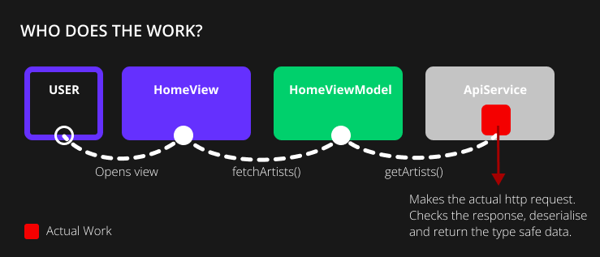
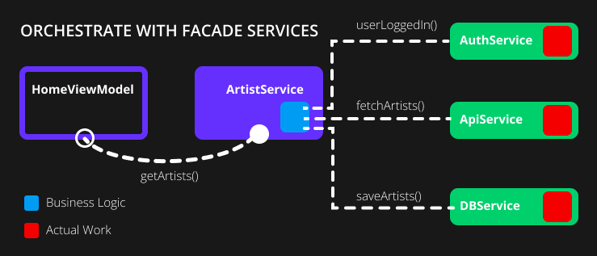

# What is a Service?

In addition to having a View (renders our UI) and a ViewModel (contains all the view state logic) we also have Services. A service, put in plain terms, is the class that does or orchestrates the actual work. There are two types of services.


## Service Types

We have a Facade Service and an App Service. _We actually are looking for better names so please reach out to collaborate if you're interested_. Let's first look at the service that "does the actual work".

### Facade Service

A facade service wraps another package to remove the hard dependency from our codebase and "does the actual work". Let's look at the problem that this solves by examining the example below:

```dart
class HomeViewModel extends BaseViewModel {
  List<Artist> _artists = [];

  Future<void> fetchArtists() async {
    // #1: Structure the http request
    final response = await http.get(Uri.https('venu.is', '/artists'));

    // #2: Validate the request is successful
    if (response.statusCode < 400) {
      // #3: Convert the response into a map
      final responseBodyAsMap = jsonDecode(response.body);

      // #4: Get relevant data from the response
      final artistMaps =
          responseBodyAsMap['data'] as List<Map<String, dynamic>>;
      
      // #5: Deserialize into a list of artists
      _artists = artistMaps.map(Artist.fromJson).toList();
    }
  }
}

class Artist {
  final String name;
  final String coverImage;

  Artist({required this.name, required this.coverImage});

  factory Artist.fromJson(Map<String, dynamic> data) => Artist(
        name: data['name'],
        coverImage: data['coverImage'],
      );
}
```

In the code above, we can see that "the work being done" is all done by the `HomeViewModel`. This means the `HomeViewModel` has the responsibility to structure and make the http request (#1), check that it was successful (#2) and deserialize the response into a list of Artists (#3, #4, #5). This is quite common in Flutter. In fact, in most cases, you are taught to do this in your `initState` function 🤯🤯 which, if you're on this page, I beg you never to do.

This is where the Facade Service comes in. The `HomeViewModel`, like all other ViewModels, is there to manage the app state logic and to maintain the View state. It should not be doing the actual work mentioned above. To fix this, we introduce a service that wraps all of this for us. This is what we want it to look like in our mental model:



As indicated by the red block, the View and the ViewModel should do no work. They delegate to the service, where all the actual work is done. Let's look at an example. In your stacked project run:

```shell
stacked create service api
```

This will generate an `ApiService` class and register it with the service locator, generate the unit test file and register the service mock for unit testing. In the `ApiService`, we can now create a type-safe version of the work that was being done by the ViewModel. We'll move it all into a function called `getArtists` that returns a `List<Artist>` for us:

```dart
class ApiService {
  Future<List<Artist>> getArtists() async {
    final response = await http.get(Uri.https('venu.is', '/artists'));
    if (response.statusCode < 400) {
      final responseBodyAsMap = jsonDecode(response.body);
      final artistMaps =
          responseBodyAsMap['data'] as List<Map<String, dynamic>>;
      return artistMaps.map(Artist.fromJson).toList();
    }

    throw Exception('Response Code: ${response.statusCode} - ${response.body}');
  }
}
```

Now that we've wrapped the package functionality (and implementation) into a Service we can use it in the `HomeViewModel`:

```dart
class HomeViewModel extends BaseViewModel {
  final _apiService = locator<ApiService>();
  List<Artist> _artists = [];

  Future<void> fetchArtists() async {
    _artists = await _apiService.getArtists();

    // Do some stuff with artists or extract additional state e.g.
    // empty state, multi select, etc ...
  }
}
```

That's all that is required to create a Facade Service. With this small change, your code benefits in the following ways:

- **Separation of Concerns / Single responsibility**: You have now separated the concern of http requests, deserialize, error checking and model construction from the ViewModel. The ViewModel can now focus only on managing the state for the view.
- **More Testable**: Since the hard dependency on the Http package has been removed it means you can mock out the `ApiService` and write deterministic unit tests for your ViewModel. 
- **DRY Code**: Any other ViewModel or Service that requires this functionality can simply locate the service and make use of the `getArtists` function. No need to repeat it somewhere else.
- **Code Readability**: In my opinion, the code looks better and it's easy to see - at a high level - what's expected without having to see the construction of the http requests and the messiness of deserializing the request into a separate list.

This pattern is the core of Stacked's appeal. In almost every situation the Stacked experts will recommend to "Create a service and call it in your ViewModel".

### App Service

An App Service (for lack of a better name) is where your business logic lies. These types of services orchestrate the interaction between Facade Services to complete some domain (business) logic. Take for example an `ArtistService` that has a function that does the following: 

- Checks if a user is logged in
- Fetches artists when a user is logged in
- Saves the artists to the local Database when returned

This is how we want this "Feature" to look in our mental model:



We create a function in the `ArtistService` that uses our Facade Services to delegate the actual work to be done. Let's see how that looks in code. _This code assumes that the other services are already created. This is not a full example of creating an Auth Service or a DB Service, but instead, only showcases how to use those services._

In your App Service class, the `ArtistService`, what you'll do is:

- Locate the Services required using the `locator` _Service location doc coming soon!_
- Use their singular functionalities to orchestrate the business logic

In code this translates to the following:

```dart
class ArtistService {
  final _databaseService = locator<DatabaseService>();
  final _authenticationService = locator<AuthenticationService>();
  final _apiService = locator<ApiService>();

  Future<List<Artist>> getArtists() async {
    // Check if user is logged in
    if (_authenticationService.userLoggedIn()) {
      // Get the artists from the backend
      final newArtists = await _apiService.getArtists();

      // Save to the database
      await _databaseService.saveArtists(newArtists);

      return newArtists;
    }

    throw Exception('User must be logged in to see artists');
  }
}
```

We locate each of the Services and then use their functionalities to achieve our goal. This makes our feature development process very clear and easy to read when looking at our App Services.

This wraps up our definition of Services.