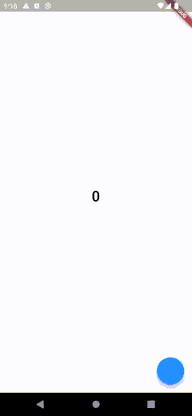

Stacked creates a simple View to ViewModel relationship that allows us to perform state management without a lot of boilerplate code. The idea is to completely separate our state from our UI, allowing us to easily test and extend logic without affecting the UI. Let's see how that works.


# Let's Try it Out

In the app that you created during the [Get Started guide](./00-overview.md) we'll create a new View called `counter`, I know, very original, but this is just to show you the basics of Stacked. To create a new View with Stacked run the following command:

```shell
stacked create view counter
```

This command will create three files for us:

1. [counter_view.dart](#counter-view): This is where you build your UI using Flutter widgets
2. [counter_viewmodel.dart](#counter-viewmodel-flutter-statemanagement): Store state and perform actions for users as they interact
3. counter_viewmodel_test.dart: Contains all the **unit** tests for the `CounterViewModel`

Let's dissect the View first.


## Counter View

The `CounterView` contains our UI that will be shown on the device. By looking at the View structure, you can see we don't extend from `StatelessWidget` or `StatefulWidget`. Instead, we extend from a `StackedView`:

```dart
class CounterView extends StackedView<CounterViewModel> {

  @override
  // A builder function that gives us a ViewModel
  Widget builder(
    BuildContext context,
    CounterViewModel viewModel,
    Widget? child,
    ) {
    return Scaffold(
      ...
    );
  }

  @override
  CounterViewModel viewModelBuilder(BuildContext context) => CounterViewModel();
}
```

In addition, you can also see a required override called `viewModelBuilder`. This function constructs our ViewModel that will store our state. But before we jump into that, let me show you how this View / ViewModel thing works. This is the foundation of Stacked's State Management. The goal of the `StackedView` is to "bind our ViewModel to our UI". This allows us to completely separate state and logic code from our UI. The mechanism is quite simple.

**Build the UI from the ViewModel, update the ViewModel and then rebuild the UI from that ViewModel.** Here's a little diagram that visually depicts the explanation below:


1. The `viewModelBuilder` creates our `ViewModel`
2. Stacked passes that `ViewModel` to our `builder` function
3. The `builder` function creates our UI
4. The user interacts with that UI
5. The interaction goes to the `ViewModel`, updates the `ViewModel`, then requests to `rebuildUi`
6. The `rebuildUi` function triggers the `builder` function with the updated `ViewModel` to rebuild the UI

That's how simple the process is. With this process you can manage 100% of all state scenarios without ever having to write state related code in your View file. Clean separation of your state, which is the best starting point for a maintainable application.


## Counter ViewModel: Flutter State Management

The `ViewModel` generated is probably the most basic: it's a normal class that extends from `BaseViewModel`:

```dart
class CounterViewModel extends BaseViewModel {}
```

And the state management is just as simple. For our counter example we want to store an integer that counts up, so we'll create a private integer value along with a function to increment it. When we've changed the value we call `rebuildUi` which will call our `builder` function in the [View](#counter-view):

```dart
class CounterViewModel extends BaseViewModel {
    int _counter = 0;
    int get counter => _counter;

    void incrementCounter() {
      _counter++;
      rebuildUi();
    }
}
```

To wrap up the example, let's display the counter on screen and call the `incrementCounter` function when the FAB is tapped. In the `counter_view.dart` file, update the builder function to return the following:

```dart
@override
Widget builder(BuildContext context, CounterViewModel viewModel, Widget? child) {
  return Scaffold(
    floatingActionButton:
      FloatingActionButton(onPressed: viewModel.incrementCounter),
    body: Center(
      child: Text(
        viewModel.counter.toString(),
        style: const TextStyle(
          fontSize: 30,
          fontWeight: FontWeight.bold,
        ),
      ),
    ),
  );
}
```

And the last thing to do is to open up `startup_viewmodel.dart` and change:

```dart
_navigationService.replaceWithHomeView();
```

to

```dart
_navigationService.replaceWithCounterView();
```

Finally, run your app by running `flutter run` or starting a debug session in VS Code. On the screen, you should now see a basic counter that increases as you tap on the `FloatingActionButton`.



We'll talk about the `StartupView` and `Navigation` next.
