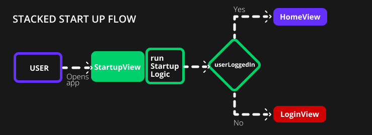

Stacked comes with some functionality that we've found to be commonly required in all applications. These functionalies include:
1. A place to run some code before the application launches
2. Navigating
3. Logging
4. Overlay UI's

In this section we'll cover #1 and touch on some of the others. 

# Startup Logic

If you created an app using the stacked cli you will have a view and viewmodel called `startup`. The goal of this view is to show directly after the spalsh screen and give you a place to run your "Startup Logic". The code you want to run before the app starts. This is where you would perform some checks to decide on where to navigate on start. Let's build something to showcase this functionality. 

Below is a diagram that shows you what we want to achieve. We want to navigate to a different place depending on if the user is logged in or not.



This is how the code executes through Stacked:
1. The app starts and opens the startup view
2. In the `StartupViewModel` the function `runStartupLogic` is executed
3. We check with our `authenticationService` if the user is logged in or not
4. If the user is logged in we go to `HomeView`
5. else we go to the `LoginView`

_Note: We the Authentication Service is fake. You should use your own authentication implementation_

## Get the views ready

We'll start off by creating the `LoginView` so we can navigate there. In your stacked project run

```shell
stacked create view login
```

When completed open `login_view.dart` and change the background color to red

```dart
class LoginView extends StatelessWidget {
  const LoginView({super.key});

  @override
  Widget build(BuildContext context) {
    return ViewModelBuilder<LoginViewModel>.reactive(
      viewModelBuilder: () => LoginViewModel(),
      builder: (context, model, child) => const Scaffold(
        backgroundColor: Colors.red,
      ),
    );
  }
}
```

Now open `home_view.dart` and change the background color to purple

```dart
class HomeView extends StatelessWidget {
  const HomeView({Key? key}) : super(key: key);

  @override
  Widget build(BuildContext context) {
    return ViewModelBuilder<HomeViewModel>.reactive(
      viewModelBuilder: () => HomeViewModel(),
      builder: (context, model, child) => const Scaffold(
        backgroundColor: Colors.purple,
      ),
    );
  }
}
```

## Register our service

Now we can create our authentication service. Run the following command

```shell
stacked create service authentication
```

This will create the service and register it for dependency inversion. Open `authentication_service.dart` where we'll add a new fuction to check if the user is logged in. For now this will return a static value for simplicity sake. 

```dart
class AuthenticationService {
  bool userLoggedIn() {
    return true;
  }
}
```

**Note:** We have a full Firebase authentication series if you want to implement real auth through stacked ([Login with Firebase using Stacked](https://www.filledstacks.com/post/sign-in-with-google-or-apple-sign-in-using-flutter/), [Advanced Custom Startup logic using Stacked](https://www.filledstacks.com/post/practical-guide-to-unit-testing-in-flutter/#writing-a-unit-test)).


## Write the Startup Logic

Open `startup_viewmodel.dart` where we can finally start writing our startup logic for the app. As we saw above, we want to check if the user is logged in, if they are go to `HomeView`, else go to the `LoginView`. This translates to the following code. 

```dart
class StartupViewModel extends BaseViewModel {
  // 1. Get the Authenication and NavigationService
  final _authenticationService = locator<AuthenticationService>();
  final _navigationService = locator<NavigationService>();

  Future runStartupLogic() async {
    // 2. Check if the user is logged in
    if (_authenticationService.userLoggedIn()) {
      // 3. Navigate to HomeView
      _navigationService.replaceWith(Routes.homeView);
    } else {
      // 4. Or navigate to LoginView
      _navigationService.replaceWith(Routes.loginView);
    }
  }
}
```

We start off by getting the services we need, `AuthenticationService` we created, `NavigationService` is apart of `Stacked`. Then we check if the user is logged in, and based on that we navigate either to `HomeView` or `LoginView` and it's that simple. If you run this code you'll see that we end up on a purple view. If you change the value in `AuthenticationService` to `false` and restart you'll see we end up on a red view. That covers the basics of the Startup code in Stacked. We touched on some other parts in there that's not explained but we'll dive into that next

:::info Complex Startup Tutorial
[Here is a more complex tutorial](https://www.filledstacks.com/post/practical-guide-to-unit-testing-in-flutter/#writing-a-unit-test) that covers some additional scenarios during startup logic. 
:::