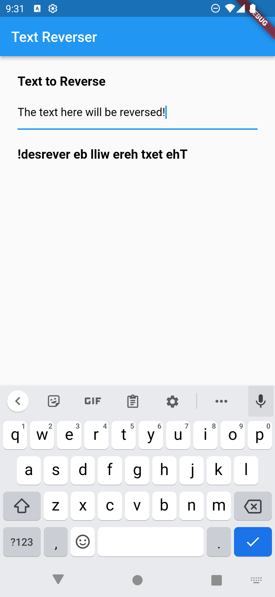
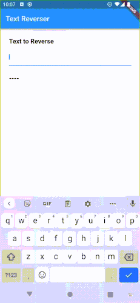

Allowing the user to input data into your app is a big part of any app. This is done in Stacked by using the Stacked Forms functionality. The most important part of this functionality is that Stacked:

1. generates all text controllers for you
2. automatically syncs the value the user types with the ViewModel
3. provides basic validation checks in the ViewModel

Let's create some basic form functionality.


# Create the View

Create a **TextReverse** View using Stacked CLI by running the following command:

```shell
stacked create view textReverse
```


## Forms in Stacked

Stacked uses a generator to create the code required to work with forms. To tell the framework which controllers to generate we add an annotation to the `View` class called `FormView`. This takes in a list of fields where you can name the controller. We'll call our TextController `reverseInput`:

```dart
import 'package:stacked/stacked_annotations.dart';

@FormView(fields: [
  FormTextField(name: 'reverseInput'),
])
class TextReverseView extends StackedView<TextReverseViewModel> {
  const TextReverseView({Key? key}) : super(key: key);
  ...
}
```

Now we can run the generate command to create our form code:

```shell
stacked generate
```

This will create a new file called `text_reverse_view.form.dart`. It contains a mixin with the same name as the class but with a `$` prefix, `$TextReverseView`. This file contains all your `TextEditingControllers`, `FocusNodes` and functionality to automatically sync those with your ViewModel, we'll cover this in more detail later.

### Automatic Text to ViewModel Synchronization

The next step is to let the View know that you want the text entered by the user to automatically sync to your `ViewModel`. To do this we have to do a few things:

1. Import the generated form file
2. Mixin the `$TextReverseView`
3. Call the `syncFormWithViewModel` function when the `viewModel` is ready

```dart
import 'add_task_view.form.dart'; // 1. Import the generated file

@FormView(fields: [
  FormTextField(name: 'reverseInput'),
])
class TextReverseView extends StackedView<TextReverseViewModel>
  with $TextReverseView { // 2. Mix in $AddTaskView Mixin

  @override
  Widget builder(
    BuildContext context,
    AddTaskViewModel viewModel,
    Widget? child,
  ) {
    return Scaffold(
      ...
    );
  }

  @override
  void onViewModelReady(AddTaskViewModel viewModel) {
    syncFormWithViewModel(viewModel);
  }
  ...
}
```

The last thing to do is to update the `TextReverseViewModel` to extend from the `FormViewModel` instead of the `BaseViewModel`.

```dart
class TextReverseViewModel extends FormViewModel {
  ...
}
```

Now the controllers can be used in any `TextWidget` that accepts a `TextEditingController` and the `ViewModel` will automatically be updated as that value changes.

### Basic UI

Since this is not a "Flutter UI building" tutorial, I'll keep this short. What we want to create is the following UI:



Now before you say anything, I know this is the most beautiful form UI you've ever seen. So please, if you want to give me compliments on the UI, [join our Slack](https://join.slack.com/t/filledstacks/shared_invite/zt-1mmpc84as-g_3l8bLHkEFekRfXnr7MXQ) where we discuss lots of cool Stacked things. 😁

<details>
<summary>TextReverseView builder code</summary>
<p>
Replace your builder function in `text_reverse_view.dart` with the following.

```dart
 @override
  Widget builder(
    BuildContext context,
    TextReverseViewModel viewModel,
    Widget? child,
  ) {
    return Scaffold(
      appBar: AppBar(title: const Text('Text Reverser')),
      body: Container(
        padding: const EdgeInsets.only(left: 25.0, right: 25.0),
        child: SingleChildScrollView(
          child: Column(
            crossAxisAlignment: CrossAxisAlignment.start,
            children: [
              verticalSpaceMedium,
              const Text(
                'Text to Reverse',
                style: TextStyle(fontSize: 18, fontWeight: FontWeight.w700),
              ),
              verticalSpaceSmall,
              TextFormField(controller: reverseInputController),
              if (viewModel.hasReverseInputValidationMessage) ...[
                verticalSpaceTiny,
                Text(
                  viewModel.reverseInputValidationMessage!,
                  style: const TextStyle(
                    color: Colors.red,
                    fontSize: 12,
                    fontWeight: FontWeight.w700,
                  ),
                ),
              ],
              verticalSpaceMedium,
              Text(
                viewModel.reversedText,
                style: const TextStyle(
                  fontSize: 18,
                  fontWeight: FontWeight.w700,
                ),
              ),
            ],
          ),
        ),
      ),
    );
  }
```
</p>
</details>

The most important part of this UI is the fact that we don't have to create or manage our controllers and can simply write this:

```dart
TextFormField(controller: reverseInputController),
```

The rest of the form functionality will be handled by our previous setup. The last thing to do is to actually reverse the text. In the `ReverseTextViewModel` we'll add a new dynamic property that will return the reversed text or a placeholder string if no text is entered:

```dart
import 'package:stacked/stacked.dart';
import 'text_reverse_view.form.dart';

class TextReverseViewModel extends FormViewModel {
  String get reversedText =>
    hasReverseInput ? reverseInputValue!.split('').reversed.join('') : '----';
}
```

Run this code to make sure everything works. As you type into the form field you should be seeing the text below it display your input in reverse order.

### Disposing of the Controllers

Since we don't create the controllers it's often forgotten that we should still dispose the controllers. This functionality is also generated for you. All that we have to do is override the dispose function in the View and call the `disposeForm` function provided by the generated form code. Add the following code in `text_reverse_view.dart`:

```dart
  @override
  void onDispose(TextReverseViewModel viewModel) {
    super.onDispose(viewModel);
    disposeForm();
  }
```

### Form Validation

The last thing to tackle in the basics is form validation. The `FormTextField` class takes in a `validator`. This is a function that returns a nullable `String` and accepts a nullable `String`. The way we supply this, is in the form of a `static` function. This is a hard requirement from annotations but also forces us to organize our validators.

Open `text_reverse_viewmodel.dart`. Underneath the class, create a new class `TextReverseValidators`. Inside it, we will create a validator with the following rules:

1. When we detect a number anywhere in the string we return `"No numbers allowed"`
2. If no numbers are present we return `null`

```dart
class TextReverseValidators {
  static String? validateReverseText(String? value) {
    if (value == null) {
      return null;
    }

    if (value.contains(RegExp(r'[0-9]'))) {
      return 'No numbers allowed';
    }
  }
}
```

To use this, we supply it as a validator to the `FormTextField` annotation:

```dart
@FormView(fields: [
  FormTextField(
    name: 'reverseInput',
    validator: TextReverseValidators.validateReverseText,
  ),
])
...
```

Now we can run `stacked generate`, which will make use of this new validator. If you run your app and type in text with a number, you'll see it prints out a red validation message with what we return. It should look something like this:



The UI for the validation message is basic. It's text that displays only when `hasReverseInputValidationMessage` is true. This is a property that's also generated for you. This brings our Form Basics to an end. We are working on a deep dive of Stacked Forms that will be coming soon.